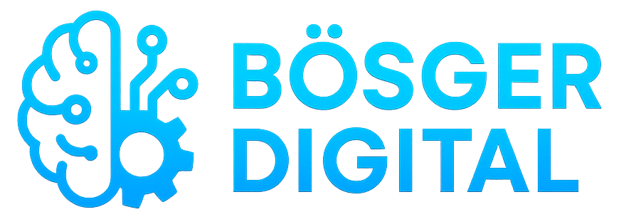
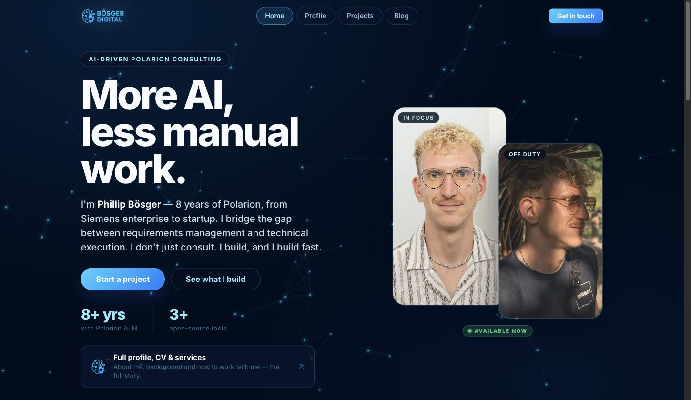

<div align="center">
  

  <h1>boesger.com</h1>
  <p><strong>More AI, less manual work.</strong></p>
  <p>Personal site and brand hub for Phillip Bösger — profile, work &amp; portfolio, blog, brand reference, and contact.</p>

  [](https://github.com/phillipboesger/boesger-website/actions/workflows/updateWebsite.yml)
  [](https://boesger.com)
  [](./LICENSE)

  **[Visit boesger.com →](https://boesger.com)**

  <br />

  
</div>

## Overview

This repository is the canonical source for `boesger.com`: a fully static, multi-page site with no build system, no package manager, and no JavaScript framework. Every page is hand-authored HTML, styled by a single shared CSS file, and enhanced by a small amount of vanilla JS (navigation, reveal-on-scroll, tabs, modals, carousel). There is nothing to install and nothing to compile — clone it, open a page in a browser, and it renders exactly as it will in production.

Other Bösger properties (`digital.boesger.com`, `polarion.boesger.com`, `colors.boesger.com`, `photography.boesger.com`, product subdomains such as `polarion-mcp.boesger.com`) are separate deployments and are not managed from this repository; they are linked from here as external references.

## Tech Stack

- **HTML5 / CSS3** — hand-authored, no templating engine.
- **Vanilla JavaScript** — no framework, no bundler, no transpilation step.
- **GitHub Pages** — static hosting, deployed automatically on every push to `main`.
- **Cloudflare** — DNS and CDN in front of the custom domain, including a small edge Worker (see `cloudflare/tools-proxy/`) that reverse-proxies select product subdomains under `boesger.com/tools/<slug>`.

## Project Structure

```
index.html                    Home — hero, work/portfolio teaser, blog teaser, contact CTA
profile.html                  Profile — overview, CV, skills, working-with-me, about (tabbed)
work.html                     Full work & portfolio grid
work/
  polarion-mcp.html           Project detail page
  polarion-docker.html        Project detail page
  polarion-code-editor.html   Project detail page
  ai-enablement-hub.html      Project detail page
blog.html                     Blog topic teaser + newsletter CTA
colors.html                   Complete brand/identity reference (logos, palette, tokens)
automation.html               n8n / Proxmox homelab showcase
links.html                    Compact link-in-bio page (social bio link target)
contact.html                  LinkedIn / email / book-a-call contact cards
imprint.html                  Imprint / legal disclosure
privacy.html                  Privacy policy

assets/
  css/style.css               All styling; design tokens as CSS custom properties in :root
  js/network.js               Animated particle-network canvas background (every page)
  js/site.js                  Nav, mobile menu, reveal-on-scroll, tabs, modal, carousel
  js/snowfall.js              Alternative background animation (currently unused)
  images/                     Photos, logos, product icons
  documents/                  Downloadable documents (e.g. CV PDF)
  gif-readme/                 Legacy demo asset from the original template (unused)

cloudflare/tools-proxy/       Optional Cloudflare Worker; see its own README for setup
CLAUDE.md                     Detailed architecture and conventions reference for this repo
```

## Local Development

No build step is required.

- Open any `.html` file directly in a browser, or
- Serve the folder with any static file server, e.g. `python3 -m http.server`.

## Deployment

Pushing to `main` triggers `.github/workflows/updateWebsite.yml`, which publishes the repository contents to GitHub Pages. The custom domain (`boesger.com`) and DNS/CDN are configured through Cloudflare and the repository's Pages settings.

`style.css`, `site.js`, and `network.js` are cached for 4 hours at the edge (and by browsers). Each HTML page references them with a shared `?v=YYYYMMDDx` cache-busting query string — bump that string across every page when any of those three files change, so visitors don't get new markup paired with stale styles or scripts.

## Customization

For the full architecture reference, design-token table, and copy-paste patterns for links, work cards, section headings, tabs, and the media carousel, see [`CLAUDE.md`](./CLAUDE.md).

## License

Released under the MIT License. See [`LICENSE`](./LICENSE) for details.
